# 用户管理数据流设计

## 概述

本文档详细说明 N-Admin 用户管理模块的数据流向、API 调用链路、状态更新机制和错误处理流程。

## 整体数据流架构

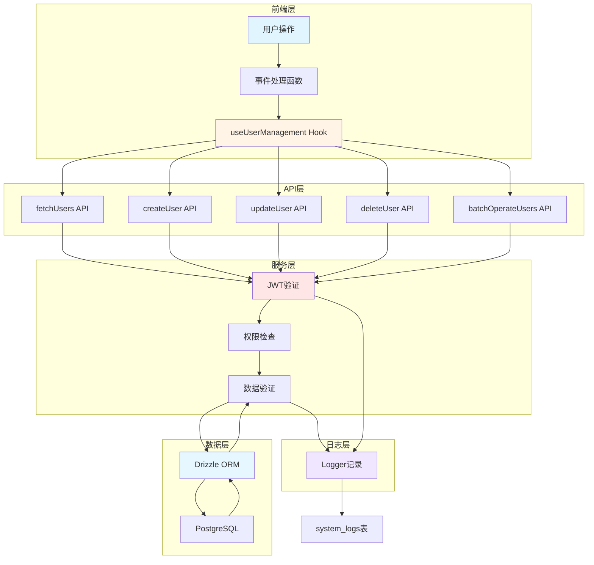

## 用户查询数据流

### 时序图

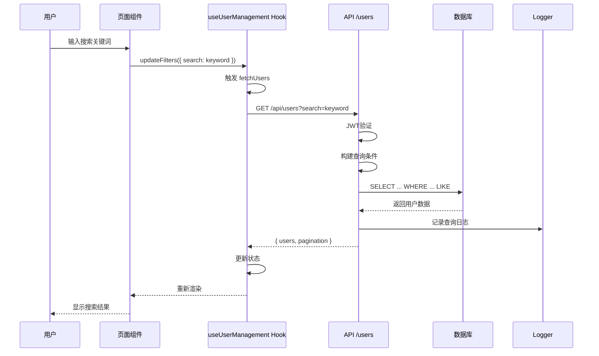

### 查询条件构建流程

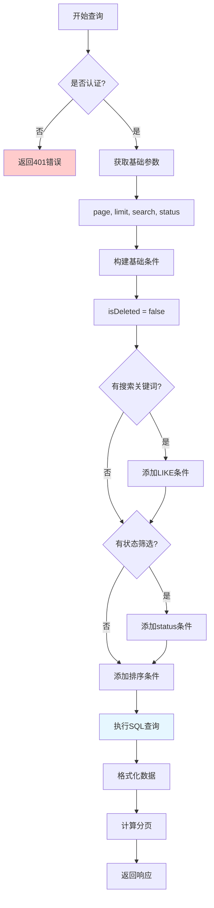

### 查询条件代码实现

```typescript
// 1. 基础条件
const conditions = [eq(users.isDeleted, false)];

// 2. 搜索条件（支持多字段模糊搜索）
if (search) {
  conditions.push(
    sql`(${users.username} ILIKE ${'%' + search + '%'} OR
         ${users.email} ILIKE ${'%' + search + '%'} OR
         ${users.realName} ILIKE ${'%' + search + '%'} OR
         ${users.phone} ILIKE ${'%' + search + '%'})`
  );
}

// 3. 状态筛选
if (status && status !== 'all') {
  conditions.push(eq(users.status, status));
}

// 4. 租户隔离（非超级管理员）
if (!currentUser?.isSuperAdmin) {
  conditions.push(eq(users.tenantId, currentUser.tenantId));
}

// 5. 排序
const orderByClause = sortOrder === 'desc'
  ? desc(users[sortBy])
  : asc(users[sortBy]);

// 6. 执行查询
const users = await db
  .select()
  .from(users)
  .where(and(...conditions))
  .limit(limit)
  .offset((page - 1) * limit)
  .orderBy(orderByClause);
```

## 用户创建数据流

### 时序图

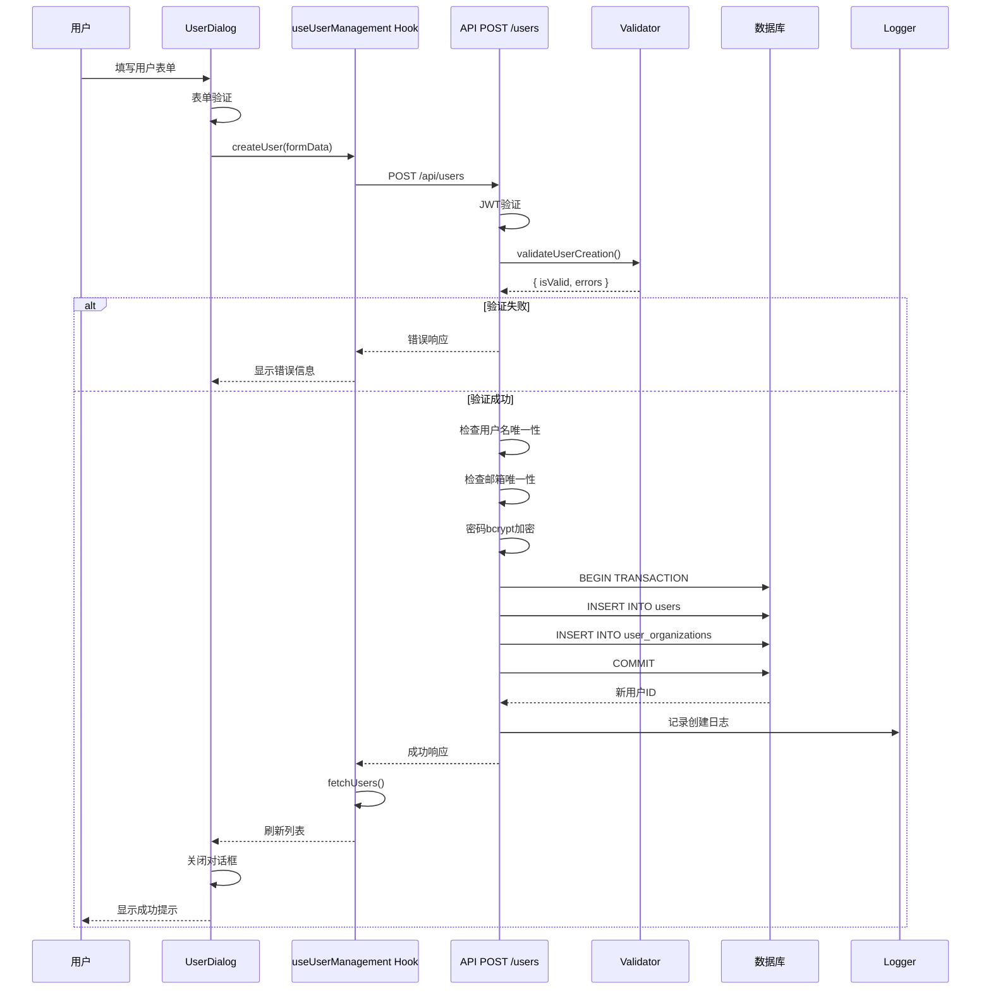

### 创建流程状态机

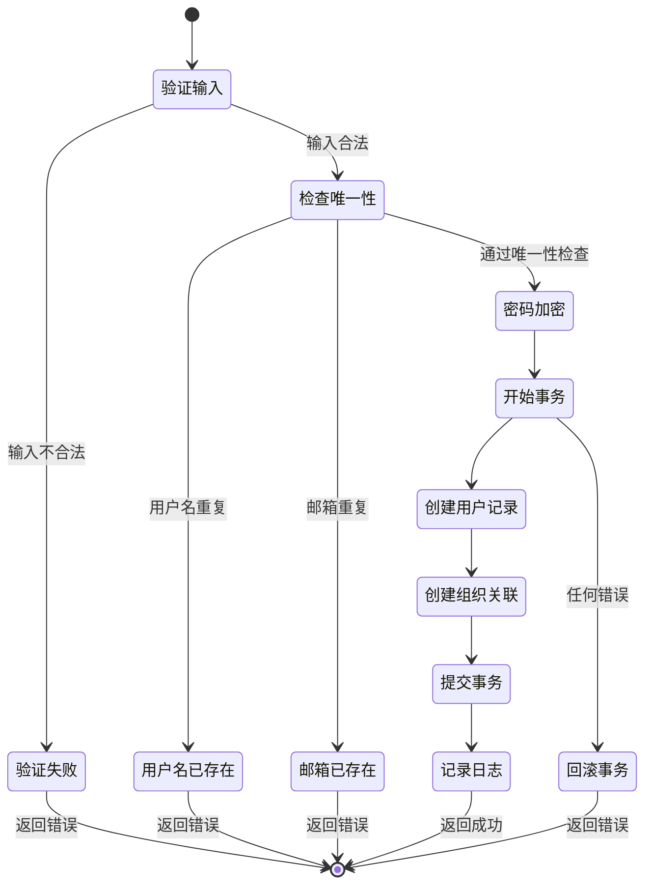

### 事务处理流程

```typescript
await db.transaction(async (tx) => {
  // 1. 创建用户记录
  const newUser = await tx.insert(users).values({
    username,
    email,
    password: hashedPassword,
    phone,
    realName,
    roleId,
    tenantId,
    status,
    avatar: '/avatars/default.jpg',
    createdBy: currentUser?.id,
    updatedBy: currentUser?.id
  }).returning({ id: users.id });

  // 2. 创建组织关联
  if (organizationIds && organizationIds.length > 0) {
    const orgRelations = organizationIds.map((orgId, index) => ({
      userId: newUser[0].id,
      organizationId: BigInt(orgId),
      position: '',
      isMain: index === 0 // 第一个组织为主组织
    }));

    await tx.insert(userOrganizations).values(orgRelations);
  }

  // 事务自动提交
});
```

## 用户更新数据流

### 时序图

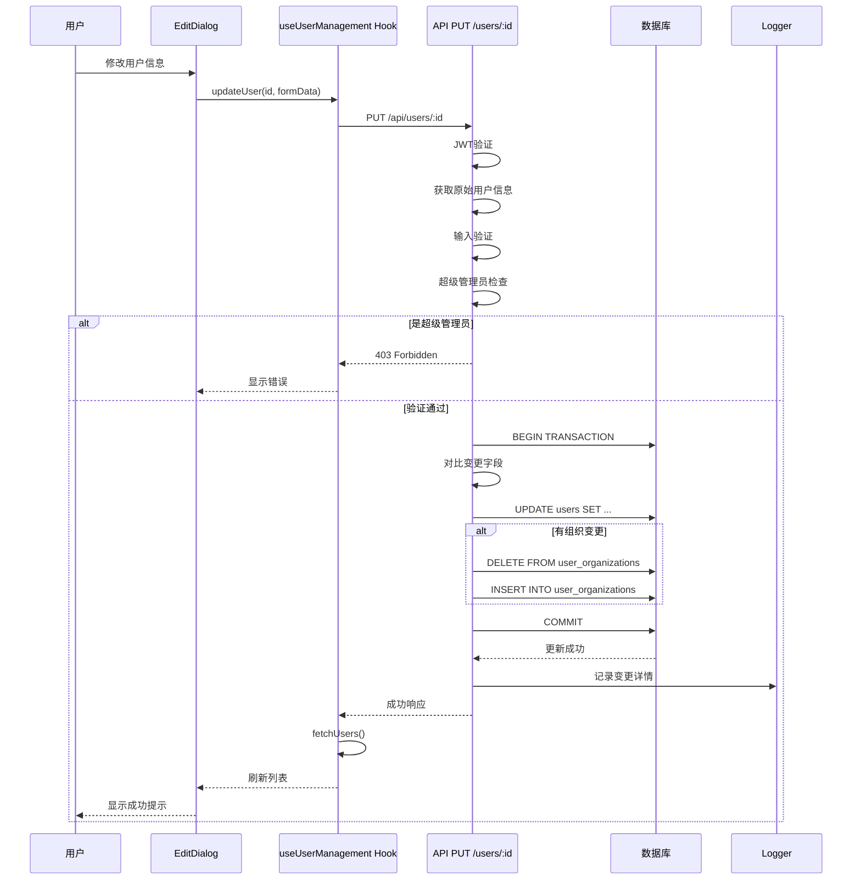

### 变更追踪机制

```typescript
// 1. 获取原始数据
const originalUser = await db
  .select()
  .from(users)
  .where(eq(users.id, id))
  .limit(1);

// 2. 对比变更
const changedFields = {
  username: originalUser[0].username !== username
    ? { from: originalUser[0].username, to: username }
    : undefined,
  email: originalUser[0].email !== email
    ? { from: originalUser[0].email, to: email }
    : undefined,
  // ... 其他字段
};

// 3. 记录变更日志
await logger.info('更新用户', '用户信息更新成功', {
  targetUserId: id,
  targetUsername: originalUser[0].username,
  changedFields,
  operatorId: currentUser?.id,
  operatorName: currentUser?.username
});
```

## 用户删除数据流

### 时序图

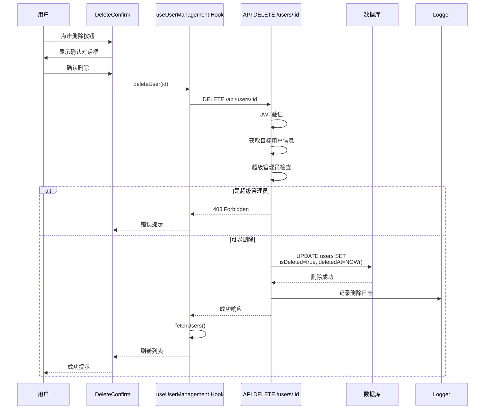

### 软删除实现

```typescript
// 不使用物理删除，使用标记删除
await db
  .update(users)
  .set({
    isDeleted: true,
    deletedAt: new Date(),
    updatedBy: currentUser?.id
  })
  .where(eq(users.id, id));

// 日志记录
await logger.warn('删除用户', '用户删除成功', {
  targetUserId: id,
  targetUsername: targetUser[0].username,
  targetEmail: targetUser[0].email,
  deletedAt: new Date().toISOString(),
  operatorId: currentUser?.id,
  operatorName: currentUser?.username
});
```

## 批量操作数据流

### 时序图

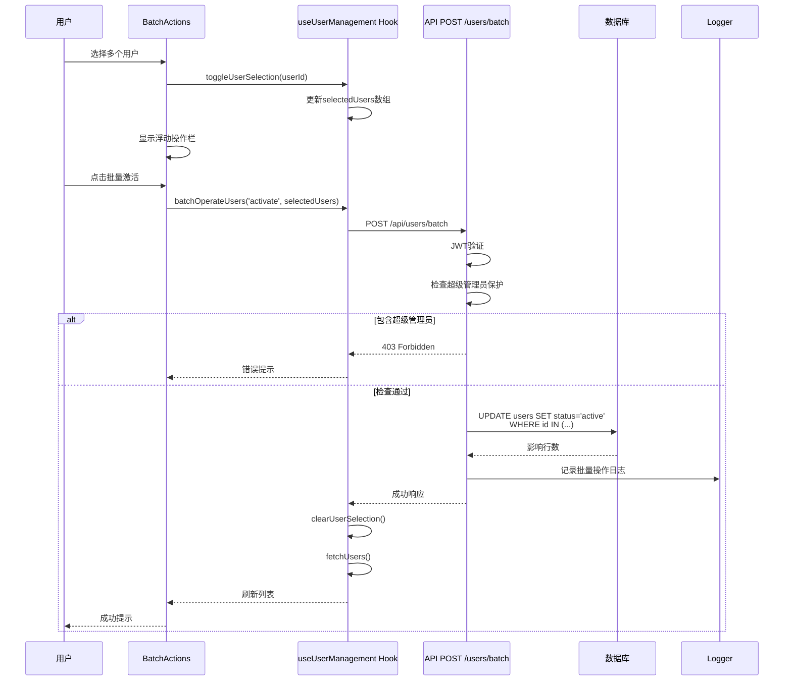

### 批量操作流程

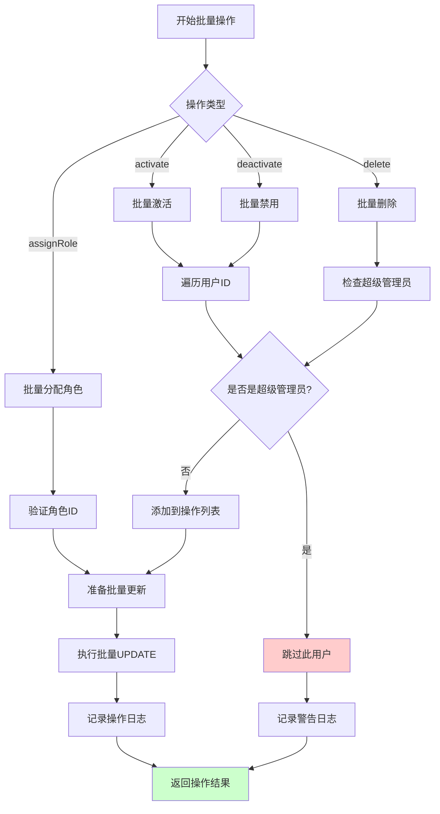

## 状态管理流程

### React状态更新流程

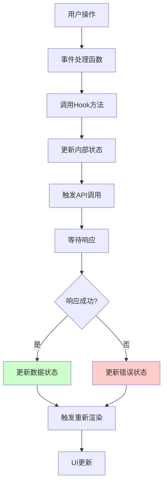

### useUserManagement Hook状态流

```typescript
interface UserManagementState {
  // 数据状态
  users: User[];                    // 用户列表
  roles: Role[];                    // 角色列表
  loading: boolean;                 // 加载状态
  error: string | null;             // 错误信息
  pagination: PaginationInfo;       // 分页信息
  statistics: UserStatistics;       // 统计数据

  // 选择状态
  selectedUsers: number[];          // 选中的用户ID

  // 操作方法
  fetchUsers: (filters: UserFilters) => Promise<void>;
  createUser: (data: UserFormData) => Promise<boolean>;
  updateUser: (id: number, data: UserFormData) => Promise<boolean>;
  deleteUser: (id: number) => Promise<boolean>;
  // ...
}

// 状态更新流程
const fetchUsers = async (filters: UserFilters) => {
  setLoading(true);
  setError(null);

  try {
    const response = await fetch('/api/users?' + buildQueryString(filters));
    const data = await response.json();

    if (data.success) {
      setUsers(data.data);
      setPagination(data.pagination);
    } else {
      setError(data.error);
    }
  } catch (error) {
    setError('获取用户列表失败');
  } finally {
    setLoading(false);
  }
};
```

## 错误处理流程

### 错误处理策略

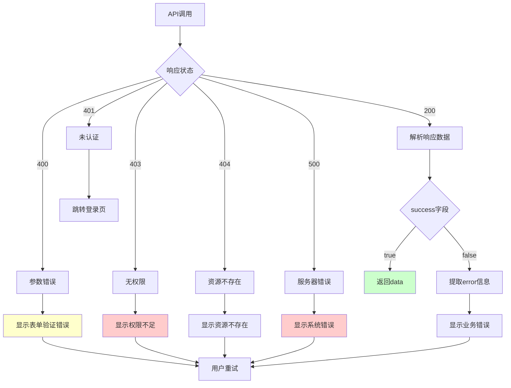

### 错误处理代码示例

```typescript
// API层错误处理
export async function PUT(request: Request, { params }: { params: Promise<{ id: string }> }) {
  const currentUser = getCurrentUser(request);
  const logger = new Logger('用户管理', currentUser?.id);

  try {
    // ... 业务逻辑

  } catch (error) {
    // 记录错误日志
    await logger.error('更新用户', '更新用户失败：系统错误', {
      error: error instanceof Error ? error.message : String(error),
      stack: error instanceof Error ? error.stack : undefined,
      operatorId: currentUser?.id,
      operatorName: currentUser?.username
    });

    // 返回错误响应
    return errorResponse((error as Error)?.message || '更新用户失败');
  }
}

// 前端错误处理
const updateUser = async (id: number, data: UserFormData) => {
  try {
    const response = await fetch(`/api/users/${id}`, {
      method: 'PUT',
      headers: { 'Content-Type': 'application/json' },
      body: JSON.stringify(data)
    });

    const result = await response.json();

    if (!result.success) {
      // 显示错误消息
      toast.error(result.error || '操作失败');
      return false;
    }

    toast.success('操作成功');
    return true;

  } catch (error) {
    console.error('API调用失败:', error);
    toast.error('网络错误，请重试');
    return false;
  }
};
```

## 数据缓存策略

### 缓存层次

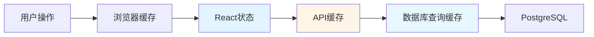

### 缓存失效策略

```typescript
// 创建/更新/删除后刷新列表
const handleCreateUser = async (data: UserFormData) => {
  const success = await createUser(data);
  if (success) {
    // 清除缓存
    await fetchUsers(filters); // 重新获取最新数据
  }
};

// 筛选条件变化时刷新列表
useEffect(() => {
  fetchUsers(filters);
}, [filters, fetchUsers]);
```

## 性能优化

### 查询优化

```typescript
// 1. 只查询需要的字段
const users = await db
  .select({
    id: users.id,
    username: users.username,
    email: users.email,
    // 只选择必要字段
  })
  .from(users);

// 2. 使用索引
// users表索引：username, email, tenant_id, status, is_deleted

// 3. 分页查询
const users = await db
  .select()
  .from(users)
  .limit(limit)
  .offset((page - 1) * limit);

// 4. JOIN优化
const users = await db
  .select({
    user: users,
    role: roles
  })
  .from(users)
  .leftJoin(roles, eq(users.roleId, roles.id));
```

### 请求优化

```typescript
// 1. 防抖搜索
const debouncedSearch = useMemo(
  () => debounce((keyword: string) => {
    updateFilters({ search: keyword });
  }, 300),
  []
);

// 2. 并行请求
const [users, statistics] = await Promise.all([
  fetchUsers(filters),
  fetchStatistics()
]);

// 3. 请求取消
const abortController = new AbortController();
fetch('/api/users', {
  signal: abortController.signal
});
```

## 数据流总结

| 数据流类型 | 特点 | 优化策略 |
|-----------|------|----------|
| 查询流 | 只读操作 | 缓存、索引、分页 |
| 创建流 | 写入操作 | 事务、唯一性检查 |
| 更新流 | 修改操作 | 变更追踪、乐观锁 |
| 删除流 | 软删除 | 标记删除、审计日志 |
| 批量流 | 批量操作 | 事务批处理、进度反馈 |
| 状态流 | React状态 | 防抖、缓存更新 |
| 错误流 | 异常处理 | 统一错误处理、日志记录 |
