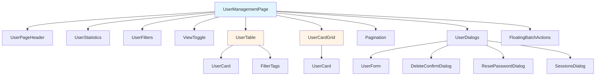
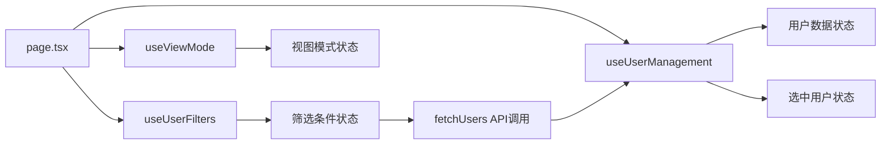
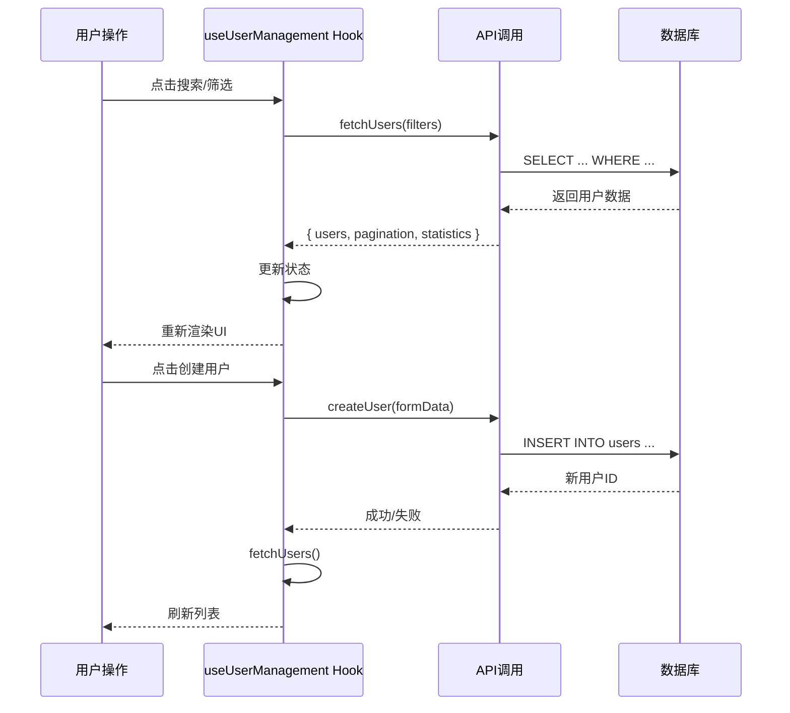
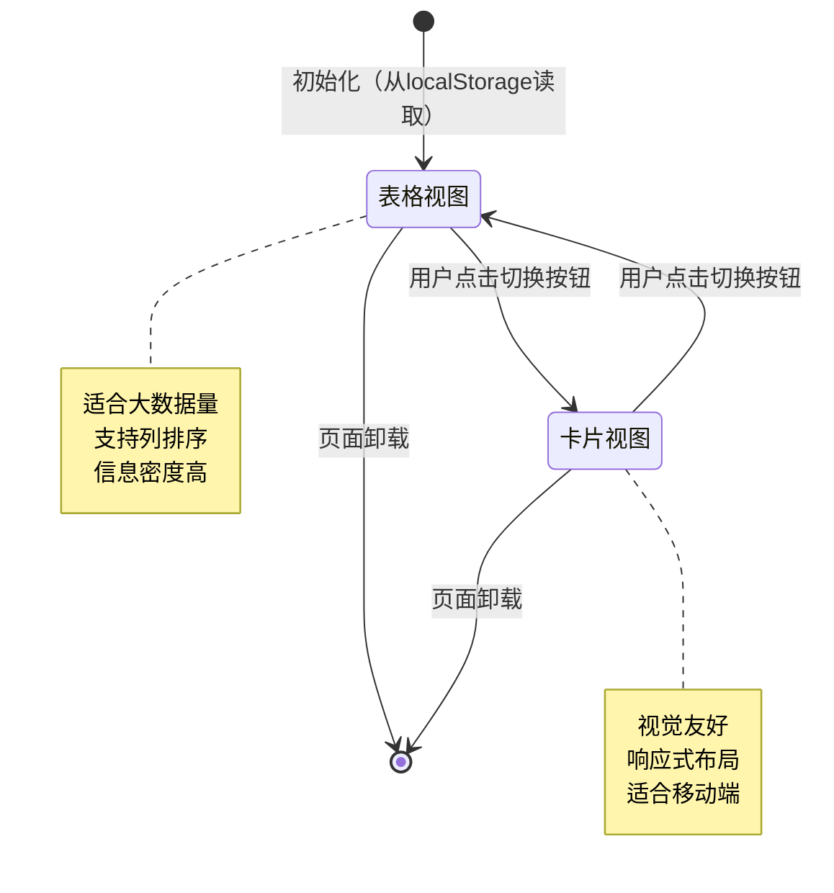
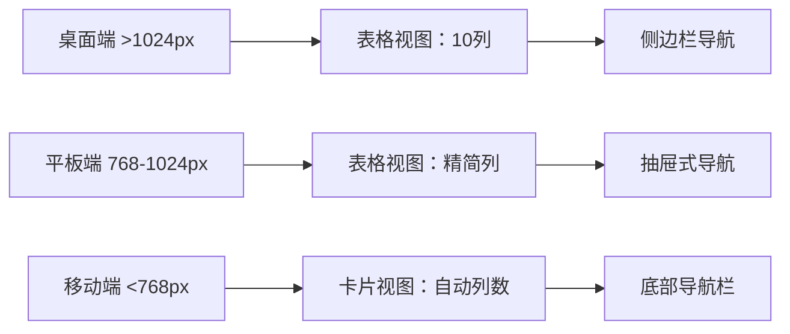

# 用户管理页面设计

## 概述

用户管理页面（`/dashboard/account/user`）是 N-Admin 系统的核心功能模块，提供完整的用户账号管理功能。页面采用现代化的组件化设计，支持表格和卡片两种视图模式，具有丰富的搜索、筛选、批量操作功能。

**页面路径**: `src/app/dashboard/account/user/page.tsx`

## 组件层次结构



## 文件目录结构

```
src/app/dashboard/account/user/
├── page.tsx                        # 主页面组件
├── layout.tsx                      # 页面布局
├── components/                     # UI组件目录
│   ├── UserCard.tsx               # 用户卡片组件
│   ├── UserCardGrid.tsx           # 卡片网格布局
│   ├── UserDialogs.tsx            # 对话框管理器
│   ├── UserFilters.tsx            # 搜索筛选组件
│   ├── UserForm.tsx               # 用户表单
│   ├── UserPageHeader.tsx         # 页面头部
│   ├── UserStatistics.tsx         # 统计信息组件
│   ├── UserTable.tsx              # 表格组件
│   ├── FilterTags.tsx             # 筛选标签显示
│   ├── FloatingBatchActions.tsx   # 浮动批量操作栏
│   ├── ViewToggle.tsx             # 视图切换器
│   └── index.ts                   # 组件导出
├── hooks/                          # 自定义Hooks
│   ├── useUserFilters.ts          # 筛选状态管理
│   ├── useUserManagement.ts       # 用户数据和操作
│   └── useViewMode.ts             # 视图模式管理
├── types.ts                        # TypeScript类型定义
└── constants.ts                    # 常量配置
```

## UI组件详细说明

### 1. UserPageHeader（页面头部）

**文件**: `src/app/dashboard/account/user/components/UserPageHeader.tsx`

**功能**:
- 显示页面标题和图标
- 提供操作按钮：添加用户、导入、导出、刷新
- 显示用户总数统计

**Props**:
```typescript
interface UserPageHeaderProps {
  onCreateUser: () => void;      // 创建用户回调
  onExportUsers: () => void;     // 导出用户回调
  onImportUsers: () => void;     // 导入用户回调
  onRefresh: () => void;         // 刷新数据回调
  totalUsers?: number;           // 用户总数
  activeUsers?: number;          // 活跃用户数
  loading?: boolean;             // 加载状态
}
```

### 2. UserStatistics（统计信息）

**文件**: `src/app/dashboard/account/user/components/UserStatistics.tsx`

**功能**:
- 展示用户统计数据卡片
- 包含总数、活跃、锁定等指标
- 显示趋势变化（增长/下降）

**统计维度**:
```typescript
interface UserStatistics {
  overview: {
    total: number;        // 总用户数
    active: number;       // 活跃用户
    inactive: number;     // 非活跃用户
    locked: number;       // 锁定用户
    activeRate: number;   // 活跃率（%）
  };
  engagement: {
    recentLogins: number;      // 近30天登录用户数
    recentLoginRate: number;   // 近30天登录率（%）
  };
  growth: {
    thisMonth: number;    // 本月新增
    lastMonth: number;    // 上月新增
    growthRate: number;   // 月增长率（%）
    today: number;        // 今日新增
    week: number;         // 本周新增
  };
  distribution: {
    active: number;       // 活跃用户数
    inactive: number;     // 非活跃用户数
    locked: number;       // 锁定用户数
  };
}
```

### 3. UserFilters（搜索筛选）

**文件**: `src/app/dashboard/account/user/components/UserFilters.tsx`

**功能**:
- 全局搜索框（支持用户名、邮箱、真实姓名）
- 高级筛选面板（可展开/收起）
- 筛选条件标签显示
- 清除筛选按钮

**筛选字段**:
```typescript
interface UserFilters {
  search?: string;              // 全局搜索关键词
  username?: string;            // 用户名
  email?: string;               // 邮箱
  phone?: string;               // 手机号
  realName?: string;            // 真实姓名
  roleId?: number;              // 角色
  status?: 'all' | 'active' | 'inactive' | 'locked';  // 状态
  tenantId?: number;            // 租户
  organizationId?: number;      // 组织
  dateRange?: {                 // 时间范围
    from: Date;
    to: Date;
  };
  sortBy?: string;              // 排序字段
  sortOrder?: 'asc' | 'desc';   // 排序方向
  page?: number;                // 页码
  limit?: number;               // 每页数量
}
```

**UI布局**:
```
┌─────────────────────────────────────────────────────────┐
│ 🔍 [全局搜索框]                        [搜索] [重置]    │
├─────────────────────────────────────────────────────────┤
│ [▼ 高级筛选]                                              │
│ ┌─────────────────────────────────────────────────┐    │
│ │ 用户名 [______]  邮箱 [______]  手机号 [______]  │    │
│ │ 真实姓名 [____]  角色 [下拉选择]  状态 [下拉选择] │    │
│ │ 时间范围 [从日期] 至 [至日期]                     │    │
│ └─────────────────────────────────────────────────┘    │
│ [× 用户名: admin] [× 状态: active] [...更多] [清除全部]  │
└─────────────────────────────────────────────────────────┘
```

### 4. ViewToggle（视图切换）

**文件**: `src/app/dashboard/account/user/components/ViewToggle.tsx`

**功能**:
- 切换表格视图和卡片视图
- 视图状态持久化（localStorage）

**视图模式**:
```typescript
type ViewMode = 'table' | 'card';
```

### 5. UserTable（表格视图）

**文件**: `src/app/dashboard/account/user/components/UserTable.tsx`

**功能**:
- 表格形式展示用户列表
- 支持列排序
- 行选择（单选/全选）
- 操作列：编辑、删除、启用/禁用、重置密码、终止会话

**表格列**:
```typescript
interface UserTableColumns {
  select: Checkbox;              // 选择框
  userInfo: User;                // 用户信息（头像、用户名、邮箱）
  phone: string;                 // 手机号
  realName: string;              // 真实姓名
  role: Role;                    // 角色
  organization: Organization[];  // 组织
  status: StatusBadge;           // 状态
  activity: Timestamp;           // 最后活动时间
  actions: ActionButtons;        // 操作按钮
}
```

**操作按钮**:
```typescript
interface ActionButtons {
  onEdit: (user: User) => void;        // 编辑
  onDelete: (user: User) => void;      // 删除
  onEnable: (user: User) => void;      // 启用
  onDisable: (user: User) => void;     // 禁用
  onResetPassword: (user: User) => void; // 重置密码
  onTerminateSessions: (user: User) => void; // 终止会话
}
```

### 6. UserCardGrid（卡片视图）

**文件**: `src/app/dashboard/account/user/components/UserCardGrid.tsx`

**功能**:
- 网格卡片形式展示用户
- 响应式布局（自动调整列数）
- 卡片上显示核心信息
- 悬浮显示操作菜单

**卡片信息**:
- 用户头像和姓名
- 角色标签
- 状态徽章
- 邮箱和手机号
- 组织名称

### 7. UserDialogs（对话框管理）

**文件**: `src/app/dashboard/account/user/components/UserDialogs.tsx`

**功能**:
- 管理所有用户相关对话框
- 统一的对话框状态管理
- 对话框类型包括：
  - 创建用户对话框
  - 编辑用户对话框
  - 删除确认对话框
  - 重置密码对话框
  - 会话管理对话框

**对话框状态**:
```typescript
interface UserDialogState {
  type: 'create' | 'edit' | 'delete' | 'resetPassword' | 'sessions' | null;
  user: User | null;
  open: boolean;
}
```

### 8. UserForm（用户表单）

**文件**: `src/app/dashboard/account/user/components/UserForm.tsx`

**功能**:
- 用户创建/编辑表单
- 表单验证
- 密码强度检测
- 组织选择（多选）

**表单字段**:
```typescript
interface UserFormData {
  username: string;           // 用户名 *必填
  email: string;              // 邮箱 *必填
  password?: string;          // 密码（创建时必填）
  phone?: string;             // 手机号
  realName?: string;          // 真实姓名
  roleId: number;             // 角色 *必填
  organizationIds?: number[]; // 组织列表
  status?: 'active' | 'inactive' | 'locked'; // 状态
  metadata?: Record<string, any>; // 扩展数据
  sendWelcomeEmail?: boolean; // 是否发送欢迎邮件
}
```

**验证规则**:
```typescript
const validationRules = {
  username: {
    required: true,
    minLength: 3,
    maxLength: 50,
    pattern: /^[a-zA-Z0-9_-]+$/,
    message: '用户名长度3-50字符，只能包含字母、数字、下划线和连字符'
  },
  email: {
    required: true,
    pattern: /^[^\s@]+@[^\s@]+\.[^\s@]+$/,
    message: '请输入有效的邮箱地址'
  },
  password: {
    requiredOnCreate: true,
    minLength: 6,
    message: '密码至少6位字符'
  },
  phone: {
    pattern: /^1[3-9]\d{9}$/,
    message: '请输入有效的手机号'
  }
};
```

### 9. FloatingBatchActions（浮动批量操作）

**文件**: `src/app/dashboard/account/user/components/FloatingBatchActions.tsx`

**功能**:
- 选中用户时显示浮动操作栏
- 批量激活/禁用/删除
- 显示选中数量

**批量操作**:
```typescript
interface BatchActions {
  onBatchActivate: () => void;    // 批量激活
  onBatchDeactivate: () => void;  // 批量禁用
  onBatchDelete: () => void;      // 批量删除
  onClearSelection: () => void;   // 清除选择
  selectedCount: number;          // 选中数量
  visible: boolean;               // 是否显示
}
```

## 状态管理方案

### 自定义Hooks

页面使用三个主要的自定义Hooks来管理状态：



### 1. useUserFilters（筛选状态Hook）

**文件**: `src/app/dashboard/account/user/hooks/useUserFilters.ts`

**功能**:
- 管理所有筛选条件
- 提供筛选更新方法
- 检测是否有激活的筛选条件

**返回值**:
```typescript
interface UseUserFiltersReturn {
  filters: UserFilters;           // 当前筛选条件
  searchFilters: (keyword: string) => void;  // 全局搜索
  updateFilters: (newFilters: Partial<UserFilters>) => void;  // 更新筛选
  updatePagination: (pagination: { page?: number; limit?: number }) => void;  // 更新分页
  clearFilters: () => void;       // 清除所有筛选
  hasActiveFilters: boolean;      // 是否有激活的筛选
}
```

**方法说明**:
- `updateFilters`: 通用筛选条件更新方法，内部调用 `searchFilters`，用于表格排序等场景
- `searchFilters`: 手动搜索方法，支持 URL 同步，筛选条件变化时自动重置到第一页
- `updatePagination`: 专门用于分页更新的方法，避免触发筛选条件重置
- `clearFilters`: 清除所有筛选条件，恢复默认状态

### 2. useUserManagement（用户数据Hook）

**文件**: `src/app/dashboard/account/user/hooks/useUserManagement.ts`

**功能**:
- 管理用户列表数据
- 管理角色列表数据
- 管理选中用户状态
- 提供所有用户操作方法

**返回值**:
```typescript
interface UseUserManagementReturn {
  // 数据状态
  users: User[];                  // 用户列表
  roles: Role[];                  // 角色列表
  loading: boolean;               // 加载状态
  pagination: PaginationInfo;     // 分页信息
  statistics: UserStatistics;     // 统计数据
  selectedUsers: number[];        // 选中的用户ID列表

  // 数据获取
  fetchUsers: (filters: UserFilters) => Promise<void>;

  // 用户操作
  createUser: (data: UserFormData) => Promise<boolean>;
  updateUser: (id: number, data: Partial<UserFormData>) => Promise<boolean>;
  deleteUser: (id: number) => Promise<boolean>;
  changeUserStatus: (id: number, status: string) => Promise<boolean>;
  resetUserPassword: (id: number, newPassword: string, sendEmail: boolean) => Promise<boolean>;
  terminateUserSessions: (id: number, excludeCurrent: boolean) => Promise<boolean>;

  // 批量操作
  batchOperateUsers: (operation: string, userIds: number[]) => Promise<boolean>;

  // 选择管理
  toggleUserSelection: (userId: number) => void;
  selectAllUsers: () => void;
  clearUserSelection: () => void;
}
```

### 3. useViewMode（视图模式Hook）

**文件**: `src/app/dashboard/account/user/hooks/useViewMode.ts`

**功能**:
- 管理视图模式（表格/卡片）
- 视图模式持久化到 localStorage
- 提供视图切换方法

**返回值**:
```typescript
interface UseViewModeReturn {
  viewMode: 'table' | 'card';    // 当前视图模式
  setViewMode: (mode: 'table' | 'card') => void;  // 设置视图模式
  isInitialized: boolean;        // 是否已初始化
}
```

## 数据流设计



## 视图模式切换机制



## 权限控制实现

页面使用 `PermissionGuard` 组件进行权限控制：

```typescript
import { PermissionGuard } from '@/components/auth/permission-guard';
import { PERMISSIONS } from '@/lib/permissions';

// 示例：创建用户按钮需要特定权限
<PermissionGuard permissions={PERMISSIONS.USER.CREATE}>
  <Button onClick={handleOpenCreateDialog}>
    添加用户
  </Button>
</PermissionGuard>
```

**权限定义** (`src/lib/permissions.ts`):
```typescript
export const PERMISSIONS = {
  USER: {
    CREATE: 'user.create',
    READ: 'user.read',
    UPDATE: 'user.update',
    DELETE: 'user.delete',
    EXPORT: 'user.export',
    IMPORT: 'user.import',
    RESET_PASSWORD: 'user.resetPassword',
    MANAGE_SESSIONS: 'user.manageSessions'
  }
};
```

**超级管理员保护**:
```typescript
// 超级管理员不能被删除、禁用或修改密码
if (user.isSuperAdmin) {
  // 隐藏或禁用相关操作按钮
  return;
}
```

## 分页配置

**分页选项** (`src/app/dashboard/account/user/constants.ts`):
```typescript
export const PAGE_SIZE_OPTIONS = [10, 20, 30, 50, 100];

export const DEFAULT_PAGINATION = {
  page: 1,
  limit: 10,
  total: 0,
  totalPages: 0
};
```

**分页组件**: 使用通用的 `Pagination` 组件 (`src/components/table/pagination`)

## 空状态设计

页面设计了两种空状态：

1. **无数据状态**（无筛选条件时）:
   - 图标：Users图标
   - 标题：还没有用户
   - 描述：开始添加用户来管理您的系统
   - 操作：添加用户按钮

2. **无结果状态**（有筛选条件时）:
   - 图标：Users图标
   - 标题：未找到匹配的用户
   - 描述：请尝试调整筛选条件以查看更多结果

## 加载状态

- 全局加载：页面初始加载时显示骨架屏
- 操作加载：按钮点击后显示loading状态
- 数据刷新：刷新时在统计卡片显示loading动画

## 响应式设计



**断点配置**:
```typescript
const breakpoints = {
  sm: '640px',   // 移动端
  md: '768px',   // 平板
  lg: '1024px',  // 桌面
  xl: '1280px',  // 大屏
  '2xl': '1536px' // 超大屏
};
```

## 关键常量定义

**文件**: `src/app/dashboard/account/user/constants.ts`

```typescript
// 对话框类型
export const DIALOG_TYPES = {
  CREATE: 'create',
  EDIT: 'edit',
  DELETE: 'delete',
  RESET_PASSWORD: 'resetPassword',
  SESSIONS: 'sessions'
};

// 用户状态
export const USER_STATUS = {
  ACTIVE: 'active',
  INACTIVE: 'inactive',
  LOCKED: 'locked'
};

// 排序字段
export const SORT_FIELDS = {
  USERNAME: 'username',
  EMAIL: 'email',
  CREATED_AT: 'createdAt',
  LAST_LOGIN_AT: 'lastLoginAt'
};
```

## TypeScript类型定义

**文件**: `src/app/dashboard/account/user/types.ts`

```typescript
// 用户类型
export interface User {
  id: number;
  username: string;
  email: string;
  phone?: string;
  realName?: string;
  roleId: number;
  tenantId: number;
  avatar?: string;
  status: 'active' | 'inactive' | 'locked';
  isSuperAdmin: boolean;
  lastLoginAt?: string;
  createdAt: string;
  updatedAt: string;
  metadata?: Record<string, any>;
  role?: Role;
  organizations?: Organization[];
}

// 用户表单数据
export interface UserFormData {
  username: string;
  email: string;
  password?: string;
  phone?: string;
  realName?: string;
  roleId: number;
  tenantId?: number;
  organizationIds?: number[];
  status?: 'active' | 'inactive' | 'locked';
  metadata?: Record<string, any>;
  sendWelcomeEmail?: boolean;
}

// 筛选条件
export interface UserFilters {
  search?: string;
  username?: string;
  email?: string;
  phone?: string;
  realName?: string;
  roleId?: number;
  status?: 'all' | 'active' | 'inactive' | 'locked';
  tenantId?: number;
  organizationId?: number;
  dateRange?: {
    from: Date;
    to: Date;
  };
  sortBy?: string;
  sortOrder?: 'asc' | 'desc';
  page?: number;
  limit?: number;
}

// 分页信息
export interface PaginationInfo {
  page: number;
  limit: number;
  total: number;
  totalPages: number;
}

// 对话框状态
export interface UserDialogState {
  type: 'create' | 'edit' | 'delete' | 'resetPassword' | 'sessions' | null;
  user: User | null;
  open: boolean;
}
```

## 总结

用户管理页面采用现代化的 React 组件设计，具有以下特点：

1. **组件化架构**: 功能模块高度解耦，每个组件职责单一
2. **状态管理**: 使用自定义 Hooks 集中管理状态，逻辑清晰
3. **双视图模式**: 支持表格和卡片两种视图，满足不同场景需求
4. **权限控制**: 细粒度的权限验证，超级管理员保护机制
5. **用户体验**: 丰富的交互反馈、空状态设计、加载状态处理
6. **响应式设计**: 适配多种设备尺寸
7. **类型安全**: 完整的 TypeScript 类型定义

这个设计为用户管理提供了完整、易用、安全的操作界面。
